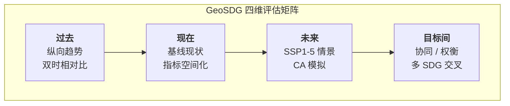
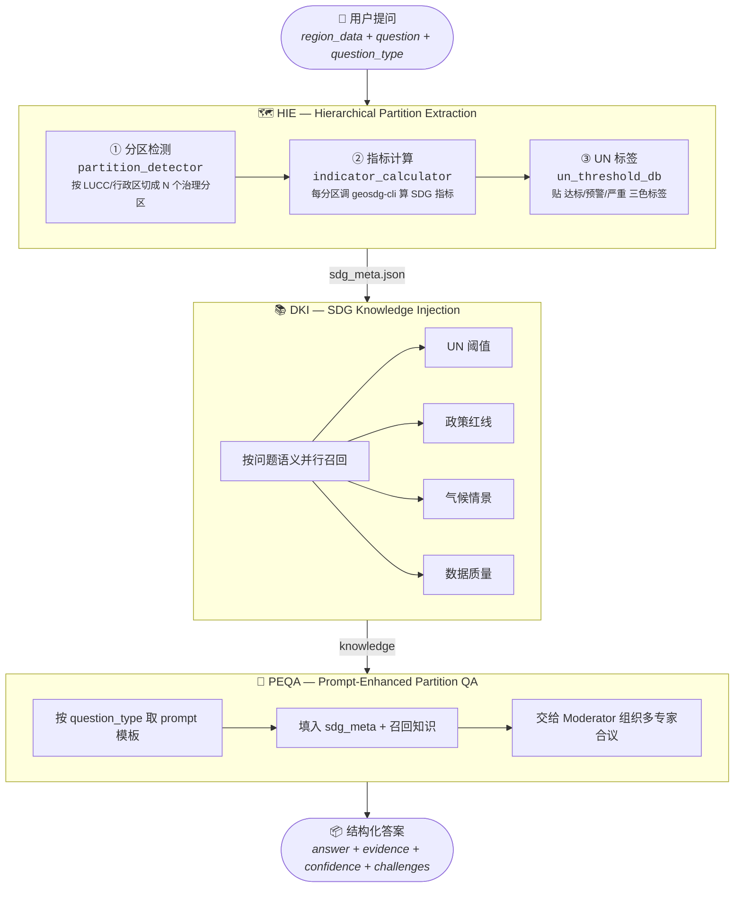
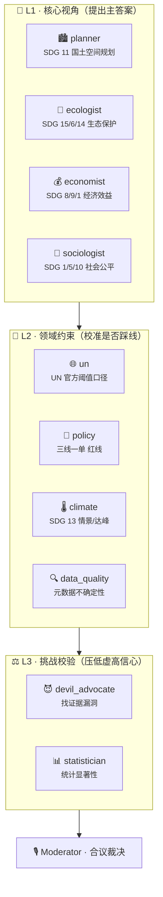
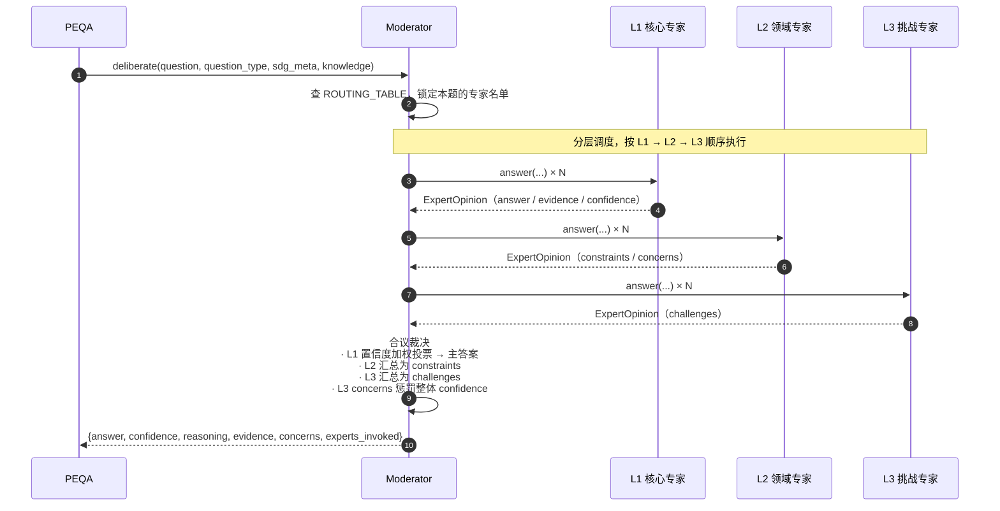

# GeoSDG-Agent

> **定位**：GeoSDG 工具箱之上的**决策 Copilot**。
>
> 给定一个研究区，Agent 把它切成若干分区，沿用 GeoSDG 的**指标空间化 + CA 模拟 + 优先区域识别**方法链读懂现状与未来，
> 并召集一支虚拟专家团**分层合议**，产出"哪里出了问题、该怎么办、有多可信"。

---

## 与 GeoSDG 工具箱的关系

GeoSDG-Agent **不重造轮子**，它是把 `cli/` 里已有的 SDG 指标计算与 CA 模拟能力，包装成对话式决策流：

| 层 | GeoSDG 已有能力 | GeoSDG-Agent 的新增职责 |
|----|----------------|------------------------|
| 数据 | `data/rasters/` — LUCC / 人口 / 基础设施 / 未来情景（SSP1-5） | 按分区裁剪、按题型召回 |
| 计算 | `cli/build/geosdg-cli` — `sdg-*` / `ca-*` / `priority-*` 十余子命令 | 由 `tool_pool` 统一调度 |
| 分析框架 | 论文 Sun et al. (2026) 的四维矩阵：过去 / 现在 / 未来 / 目标间 | 用**认知层专家**把四个维度串成决策 |
| 交付 | 栅格与统计结果 | 结构化 JSON（答案 + 证据 + 置信度 + 挑战） |

**一句话**：CLI 负责算，Agent 负责"看懂 + 权衡 + 交付"。

---

## GeoSDG 采用的四维分析矩阵

论文与 CLI 已经定义好了分析范式，Agent 严格沿用：



每个格子对应到 CLI 的一组子命令；Agent 根据题型自动选择走哪些格子。

---

## 认知主流程：HIE → DKI → PEQA

Agent 的每次问答，都要沿三段式主干走一遍：



- **HIE** 的产出物 `sdg_meta.json` 结构固定为 `{region, partitions, legend, information}`，也是 CLI 与 Agent 之间的契约。
- **DKI** 只召回和当前问题相关的知识，避免上下文膨胀。
- **PEQA** 不直接调 LLM，而是把决策权交给 Moderator，由它组织多专家合议。

---

## 认知层：10 位专家 × 3 层 × 路由表

### 专家池分层



- **L1** 关注"该怎么办"——四种视角互为镜像
- **L2** 关注"能不能这么办"——把 L1 的方案往 UN 口径、政策红线、气候情景、数据可信度上一一贴
- **L3** 关注"这答案靠不靠谱"——反方 + 统计校准

### 按题型精准召唤

不是所有专家每题都到场——每种 `question_type` 对应一份专家清单，由 `agents/routing.py::ROUTING_TABLE` 定义：

| 题型 | 走哪些维度 | L1 到场 | L2 到场 | L3 到场 | 合计 |
|------|-----------|--------|--------|--------|:----:|
| `extracting-indicator_value` | 现在 | planner | un, data_quality | — | 3 |
| `referring-partition_comparison` | 现在 | planner | un | statistician | 3 |
| `reasoning-longitudinal_trend` | 过去 → 现在 | planner | un, climate | statistician | 4 |
| `reasoning-scenario_forecast` | 现在 → 未来 | planner, ecologist | climate, data_quality | devil_advocate | 5 |
| `reasoning-tradeoff_detection` | **目标间** | **全部 L1** | un, policy | devil_advocate | 7 |
| `analyzing-priority_area` | 现在 + 目标间 | **全部 L1** | un, policy, data_quality | devil_advocate, statistician | **9** |
| `analyzing-intervention_plan` | 现在 → 未来 + 目标间 | **全部 L1** | policy, climate | devil_advocate | 8 |

**简单题少召人（读一个现状值只需 3 位），决策题召全班（分区优先级要 9 位过一遍）**——省 token，降噪，可解释。

### Moderator 合议流程



### 每位专家的统一契约

所有专家继承 `agents/base.py::ExpertBase`：

```python
class ExpertBase:
    role: str                        # "planner" / "ecologist" / ...
    layer: str                       # "L1" / "L2" / "L3"
    focus_indicators: tuple[str,...] # 该专家只看的 SDG 指标
    system_prompt: str               # 独立人设

    def answer(question, question_type, sdg_meta, knowledge) -> ExpertOpinion
    def get_knowledge(question, sdg_meta) -> dict   # 兼作 DKI 的知识源
```

`focus_indicators` 是一个精简技巧：Moderator 送进各专家的 legend 会被裁到只保留该专家关心的指标（例如 `EcologistExpert` 只看 `SDG_15_3_1` / `SDG_6_6_1`），避免专家越权或被无关信息干扰。

---

## 目录结构

```
agent/geosdg-agent/
├── copilot.py                     # 入口 sdg_copilot(region_data, question, question_type)
│
├── modules/                       # 认知主流程
│   ├── HIE.py                     # 分区提取 + 指标计算 + UN 标签
│   ├── DKI.py                     # 按问题语义召回知识
│   └── PEQA.py                    # 拼 prompt → 交给 Moderator 合议
│
├── agents/                        # 认知层（10 专家 + 编排）
│   ├── base.py                    # ExpertBase + ExpertOpinion
│   ├── routing.py                 # question_type → 专家召唤矩阵
│   ├── moderator.py               # 合议编排 + 加权投票 + 证据合并
│   │
│   ├── planner_expert.py          # L1  SDG 11 国土空间规划
│   ├── ecologist_expert.py        # L1  SDG 15/6/14 生态保护
│   ├── economist_expert.py        # L1  SDG 8/9/1 经济效益
│   ├── sociologist_expert.py     # L1  SDG 1/5/10 社会公平
│   │
│   ├── un_expert.py               # L2  UN 官方阈值口径
│   ├── policy_expert.py           # L2  中国"三线一单"红线
│   ├── climate_expert.py          # L2  SDG 13 情景/达峰/碳汇
│   ├── data_quality_expert.py     # L2  数据质量与不确定性
│   │
│   ├── devil_advocate_expert.py   # L3  找证据链漏洞
│   └── statistician_expert.py     # L3  统计显著性与置信度
│
├── tool_pool/                     # 对接 GeoSDG CLI
│   ├── partition_detector.py      # 把研究区切成 N 个分区
│   ├── indicator_calculator.py    # 每分区调 geosdg-cli 算 SDG 指标
│   └── un_threshold_db.py         # UN 阈值/达标口径知识库
│
└── utils/                         # 共享工具
    ├── prompt.py                  # 12 种题型 × 4 种格式的 prompt 模板
    ├── common.py                  # 路径/日志/RAI 过滤
    ├── api.py                     # LLM chat/select 抽象层
    └── vision.py                  # 栅格 IO 与裁剪
```

---

## 支持的 SDG 指标

`tool_pool/indicator_calculator.py` 的白名单与 CLI 现有能力对齐：

| 指标 | 语义 | 走哪个 CLI 子命令 |
|------|------|------------------|
| `SDG_2_4_1`  | 农业可持续性 | `sdg-agriculture` |
| `SDG_6_6_1`  | 水体范围变化 | `sdg-water-extent` |
| `SDG_11_3_1` | 土地消耗率 / 人口增长率 | `sdg-land-proportion` |
| `SDG_13_2_2` | 温室气体排放 | `sdg-emission` |
| `SDG_15_3_1` | 土地退化 | `sdg-land-degradation` |

新增指标 = 往这张表加一行 + 把对应专家的 `focus_indicators` 打开，其它不用动。

---

## 快速上手

```python
from agent.geosdg_agent.copilot import sdg_copilot

region_data = {
    "name": "Demo City",
    "bbox": (113.0, 22.0, 114.5, 23.5),
    "lucc_path": "data/rasters/lucc/2020.tif",
    "year": 2020,
}

result = sdg_copilot(
    region_data,
    question="在当前分区中，哪几个应被列为优先干预区？",
    question_type="analyzing-priority_area",
)
```

对于 `analyzing-priority_area` 题型，返回结构：

```json
{
  "question_type": "analyzing-priority_area",
  "answer": ["A1", "A3"],
  "confidence": 0.72,
  "reasoning": {
    "core_views":  [ {"role":"planner",...}, {"role":"ecologist",...}, ... ],
    "constraints": [ {"role":"un",...}, {"role":"policy",...}, ... ],
    "challenges":  [ {"role":"devil_advocate",...}, {"role":"statistician",...} ]
  },
  "evidence": [ ... ],
  "concerns": [ ... ],
  "experts_invoked": ["planner","ecologist","economist","sociologist",
                      "un","policy","data_quality",
                      "devil_advocate","statistician"]
}
```

直接跑 smoke test：

```bash
python agent/geosdg-agent/copilot.py
```

---

## 当前状态

**骨架阶段**：所有 `.py` 可 import，`copilot.py` 可跑通空流程，
底层工具与 LLM 调用为 mock（假数据 + echo 桩），接口与数据结构已按最终形态定型。

后续填肉建议顺序：

1. `tool_pool/partition_detector.py` — 用 GDAL 读 `data/rasters/lucc/*.tif`，按 LUCC 类型/形态学聚类分区
2. `tool_pool/indicator_calculator.py` — `subprocess` 调 `cli/build/bin/geosdg-cli` 算真实 SDG 值
3. `tool_pool/un_threshold_db.py` — 灌入论文 Table 里的 UN 官方阈值
4. `utils/api.py` — 接真实 LLM（OpenAI / 混元 / Claude 任选）
5. **可选升级：二轮争辩** — `devil_advocate` 拿 L1 结果反驳，Moderator 做二次裁决
