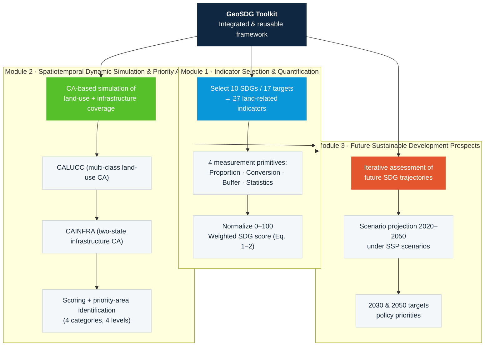

# Figure 1 — GeoSDG 方法论总览（三大模块）

对应论文 Figure 1："The GeoSDG toolkit consists of three essential steps…"

## 文字说明

GeoSDG 由三大模块构成，构成"评估 → 模拟 → 展望"的闭环：

1. **指标选择与量化**：从 UN SDGs 框架中筛选与土地动态最相关的 10 个目标、17 个子目标、27 个指标，按 4 类测量原语计算并归一化到 0–100。
2. **时空动态模拟与优先区识别**：用 CA 模型同时模拟土地利用（CALUCC）与基础设施覆盖（CAINFRA）变化，计算未来 SDG 得分并识别优先区（4 类、4 级）。
3. **未来可持续发展展望**：在 SSP 情景下投影 2020–2050 的 SDG 轨迹，支撑 2030 / 2050 目标与政策优先级。
