# Figure 3 — 指标计算范式（四类原语 → 归一化 → 加权得分）

对应论文 Figure 3："Procedure for calculating spatially explicit land-related SDG indicator…"（及 Eq. 1–2）

```mermaid
flowchart LR
    subgraph INPUT["Input Data"]
        direction TB
        I1["Land use raster"]:::mist
        I2["Population distribution"]:::mist
        I3["Road infrastructure"]:::mist
        I4["POIs"]:::mist
        I5["Topographic features (DEM)"]:::mist
    end

    subgraph PRIM["4 Measurement Primitives"]
        direction TB
        P1["① Land Proportion<br/>(land class ratio)"]:::primary
        P2["② Land Conversion<br/>(class transition over time)"]:::primary
        P3["③ Buffer Zone<br/>(population served within buffer)"]:::primary
        P4["④ Total Statistics<br/>(aggregate counts / sums)"]:::primary
    end

    subgraph NORM["Normalization (Eq. 1)"]
        direction TB
        N1["Positive: higher = better"]:::secondary
        N2["Neutral: closer to optimal"]:::secondary
        N3["Negative: lower = better"]:::secondary
        N4["Scale to 0–100"]:::secondary
    end

    subgraph SCORE["Weighted SDG Score (Eq. 2)"]
        S1["SDG = Σ wᵢ · Xnorᵢ"]:::navy
    end

    INPUT --> PRIM
    PRIM --> NORM
    NORM --> N4
    N4 --> SCORE

    classDef primary fill:#0A97D9,stroke:#0A97D9,color:#fff;
    classDef secondary fill:#56C02B,stroke:#56C02B,color:#fff;
    classDef navy fill:#0F2740,stroke:#0F2740,color:#fff;
    classDef mist fill:#F4F7FA,stroke:#CBD5E1,color:#16283A;
```

## 文字说明

每个空间 SDG 指标的计算都遵循同一范式：

1. **数据输入**：土地利用栅格 + 人口分布 + 路网 + POI + 地形等多源数据。
2. **四类原语**：27 个指标全部由 `Land Proportion`、`Land Conversion`、`Buffer Zone`、`Total Statistics` 四类测量原语组合而成。
3. **归一化**：按指标方向（正向 / 中性 / 负向）归一化到 0–1，再标准化到 0–100（Eq. 1）。
4. **加权合成**：对归一化指标加权求和得到 SDG 得分（Eq. 2）。
