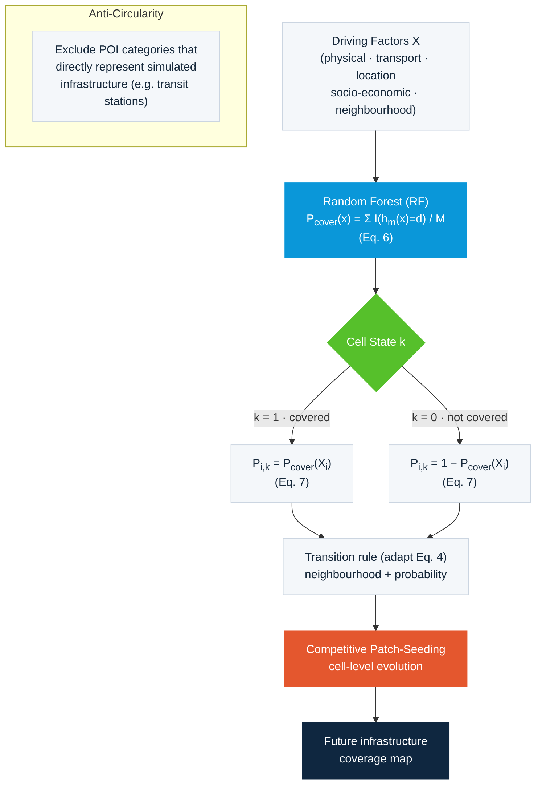

# Figure 4 — CAINFRA 基础设施 CA 框架（两状态 + 随机森林 + 竞争性斑块播种）

对应论文 Figure 4："The structure of the rule mining and simulation framework for infrastructure coverage."（及 Eq. 6–7）

## 文字说明

CAINFRA 是土地利用 CA 的简化版，仅区分两种状态（覆盖 / 未覆盖）：

1. **驱动因子 X**：物理环境、交通、区位、社会经济、邻域交互等。
2. **随机森林估计覆盖率概率**：`P_cover(x)` 由 RF 各决策树投票得出（Eq. 6）。
3. **两状态判定**：`k=1`（覆盖）取 `P_cover`，`k=0`（未覆盖）取 `1−P_cover`（Eq. 7）。
4. **竞争性斑块播种**：用覆盖率概率替代 Eq. 4 中的开发概率，模拟基础设施覆盖的逐像元演化（Figure 4）。
5. **避免循环论证**：将直接代表被模拟基础设施的 POI 类别（如公交站点）从预测变量中剔除。
